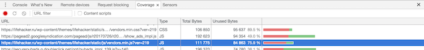

### Аудит оптимизации сайта [lifehacker.ru](https://lifehacker.ru/)

Сайт разработан на CMS WordPress, возможно, стоит спрятать админку со стандартного пути /wp-admin. Но к оптимизации это мало относится.

Будем постепенно следовать правилам, расcказанным на лекции.

#### Не загружать лишнее

- При анализе сайта с помощью сервиса PageSpeed Insight было выявлено, что для части ресурсов, запрашиваемых сервера не настроено кэширование, http-заголовок `Caсhe-Control` имеет значение **no-cache**, заголовки `Expires`, `Last-Modified`, `ETag` не используются. Рекомендуется настроить кэширование данных ресурсов.

- Для отправки web-push уведомлений используется плагин **onesignal-free-web-push-notifications**, который создает service worker. Можно установить универсальный плагин, который помимо отправки уведомлений кэшировал часть файлов для доступности сайта в оффлайн. На данный момент сайт в оффлайн недоступен совсем.

#### Передавать меньше данных

- Для большинства ресурсов на сайте включено сжатие, но есть изображения, для которых оно все же отсутствует. Рекомендуется включить сжатие и для этих ресурсов, это позволит уменьшить размер передаваемых данных на 62%(30,9КБ)

 

 Уменьшить размер передаваемых данных также поможет уменьшение размера изображений(их минификация).

- Сжатие файлов осуществляется с помощью алгоритма сжатия **gzip**, использование комбинации из двух алгоритмов сжатия -  **brotli + deflate(zopfli)** - позволит получить на 20% меньший размер файлов для браузеров, поддерживающих алгоритм **brotli** и на 5-8% - для тех, браузеров не поддерживающих **brotli**(будет использоваться **deflate(zopfli)**)

- Не все используемы на сайте скрипты и стилевые файлы минифицированы. Рекомендуется обфусцировать js и css ресурсы для уменьшения их размера, а соответственно и скорость загрузки

- Так как на сайте используется большое количество скриптов, то оптимальным решением было бы объединить их все в единый бандл. Это позволило уменьшить количество запросов, так как у браузеров есть ограничение по количеству одновременных обращений к одному хосту.
Ниже приведены ограничения для разных браузеров:
 

Хорошим решение последних двух проблем было бы использование сборщика, например, Webpack.

- На сайте настроен один CDN(является поддоменом lifehacker.ru), с которого грузятся картинки. Увеличение количества CDN позволило бы увеличить скорость загрузки сайта, так как увеличилось бы количество одновременно загружаемых ресурсов. Так же не стоит отправлять cookies на CDN.

- Некоторые плагины в <head> подключаются синхронно, возможно, имеет смысл подключать их асинхронно с помощью атрибутов **async, defer** или просто перенести их в конец <body>

- Для оптимизации загрузки стилей для устройств различного расширения можно использовать атрибут **media** в теге link, он позволит загружать стилевой файл для конкретного user-agent. Можно указывать не только расширение экрана устройства, но и тип, например, **print**, чтобы подключать отдельно стилевой файл для печати. Сейчас на сайте стилевые правила для печати указаны в медиа-выражениях в файле vendors.css.
(Но на данный момент браузер загружает все файлы, независимо от условий, указанных в media атрибуте. Что в принципе логично, поскольку среда может изменяться, но меняет порядок загрузки в зависимости от условия, тестировалось в Chrome. Возможно, вдальнейшем это будет оптимизировано браузерами)

Заметила, что в файле **all.min.css** подгружается карта исходных стилей, тогда в DevTools/Sources можно посмотреть все scss файлы исходного кода, кажется, это никак не влияет на оптимизацию(не считая лишнию строку кода), но показалось странным решением для production.

- На сайте подгружается большое количество шрифтов, объединение разных начертаний или даже шрифтов в единый файл позволило бы сократить количество запросов.

- На сайте реализована оптимизация изображений под различные разрешения устройств и различную плотность пикселей(за исключением нескольких изображений, видимо забыли или не успели). Реализовано это посредством JS, в data- атрибуты блока помещаются ссылки на картинки различного размера, а скрипт выбирает, исходя из размера экрана нужную и прописывает блоку inline стиль background-image:"....". С точки зрения семантичности, да и понятности кода оптимальнее было бы использовать атрибут **srcset** тега img или тег **picture** и подгружать необходимые изображения без использования JS. Для тех браузеров, которые не поддерживают данные возможности(Edge, IE, ...) использовать полифилл.

- Отрисовка первого экрана занимает значительное количество времени, в качестве оптимизации можно не загружать контент всей страницы, а сначала загрузить контент для первого видимого пользователю экрана, а после загружать оставшийся на странице контент.

Также для загрузки контента можно использовать виртуальный скролл.

- Анализ использования кода показал, что много кода из загружаемого на главной странице не используется. В Не будем рассматривать сторонние ресурсы, а посмотрим на ресурсы внутренние, например, файлы `vendor.css` и `vendor.min.js` использование кода этих файлов на главной странице составляет **11,5%** и **24,1%** соответственно. Очевидно, что необходимо произвести рефакторинг кода и загружать лишь требуемые стили и функции.

#### CSS

- css сайта написан с использование БЭМ-методологии, но встречаются на удивление длинные селекторы, с высокой специфичностью соответственно, например: `.television .left .inside-nolead .stripe-item__img-block`, длинные селекторы увеличивают размер css файла. По возможности, стоит использовать короткие селекторы.

- Для экранов шириной 765px и меньше меню прячется под иконку "бургер". Меню скрывается при помощь css свойства `display:none`, при клике на иконку свойство меняется на `display:block`. Данное решение не очень хорошее, потому как screen reader пропускают элементы сайта со свойством `display:none`. Правильнее было бы использовать изменение свойств `visibility + opacity` и не забыть вфынести анимацию на отдельный слой с помощью свойства `will-change`.

#### Мобильные устройства

- на мобильных устройствах(хотя на десктопе это тоже актуально) при первом заходе пользователя, чтобы избежать эффекта FOIT("вспышка невидимого текста" или просто белый экран), лучше сначала использовать системные шрифты, можно воспользоваться советами из [этой статьи](https://css-tricks.com/snippets/css/system-font-stack/), после загрузки страницы загружаем наши скрипты и кэшируем.

- загрузка всех стилей на мобильном телефоне заняла около 13 секунд, каждый RTT на мобильном устройстве - очень дорогая операция(в среднем требуется 70мс, чтобы сигнал добрался до сервера), поэтому нужно сократить число запросов до минимума. Одним из решений уменьшения количества запросов является инлайнинг стилей в html.

- при загрузке на мобильном устройстве, примерно на 8 минут происходит визуальный скачок всего контента вниз - выполняется загрузка блока рекламы. Как одно из решений, чтобы избежать перерисовки, можно сразу создать DOM-элемент для блока с рекламой с заданными размерами, а уже при получении изображения подставлять его в блок. Или вариант переместить блок с рекламой ниже, под первый видимый экран и загружать стили и шаблон по блочно: style+block, страницу отрисовывать постепенное.

- также можно создать специальную версию сайта, такую как AMP, где страница загружается моментально.

